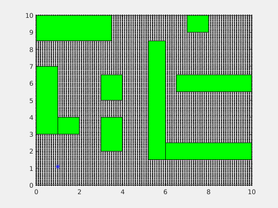

## About
My name is Anirban Sinha. I am persuing PhD in Robotics from Stony Brook University, New York. Robotics and machine learning are my two key areas of interests.

### Skills
Python, C++, Linux, git, PyTorch, C++ python wrapper, Robot Operating System (ROS), Matlab, Mathematica, OpenCV, OpenRAVE

### Internship
I have worked as software intern in [Auris Health Robotics](https://www.aurishealth.com/) in summer 2018 and contributed to software release version URO-2.1.2. My project was involved in writing publisher and subscriber codes using [RTI Python Connector](https://www.rti.com/blog/introducing-rti-labs-and-connector-for-connext-dds-with-python) to collect vision and electromagnetic field information.

## Projects
Machine learning is a fast growing field and helping people from engineering, robotics, computer science, medicines back grounds. This page is dedicated to different machine learning projects that I have done so far and those which are on going. Here I will provide highlights of each the project and associated `github` link. Some of these projects are research project and some are course projects.

### EKF-for-Trajectory-Estimation
The project focuses on the control of a mobile robot that intends to go from a given initial position to a desired goal position. The robt has to generate a path from initial to final position while avoiding obstacles simulteneously. The robot here is considered as a point mass robot.

1. Generated mesh grid and put obstacles in the grid
2. Use Dynamic Programing to figure out the path that avoids obstacles while simulteneously moving from initial to goal
3. Test the algorithm with different buffer size around the obstacles
4. Smoothing the way-points in the path
5. Generating trajectory that follows uniform speed of 1.5 through out the path
6. Designing a Control-Law considering Actuator-Constraints while tracking the desired trajectory
7. Designing an Observer by Reduced-Order-Observer method
8. Implementing Seperation-Principle to combine Controller and Observer

**Evolution of cost in Value-Iteration**

**Figure above shows, how a robot uses partially observable states to reach from start to goal while avoiding the obstacles**

### LASSO Regression for Feature Selection
Least Absolute Shrinkage and Selection Operator or LASSO is a regression method, highly used in Machine learning community for determining important features when number of features are lot more than needed. We have solved LASSO regression problem using synthetic data that finds only 10 important features out of 80 given features that are required to predict correct targets reliably. In short, LASSO regression helps to obtain sparse solution whenever possible. Use have used popular coordinate descent algorithm to minimize the convex loss function of LASSO. 
<!-- The github link for this project can be found 
[here](https://github.com/anirban-bot/Coordinate-descent-LASSO)-->

### Support Vector Machines Primal and Dual Solution
This project is associated to binary classification problem using SVM with Quadratic Programming as optimization algorithm. We solve the classification problem in two different ways, first by optimizing the primal formulation of SVM and secondly by solving the dual formulation of SVM. We checked whether both ways provide same solution to validate correctness of the implementation. We also tried to understand how to select a good threshold to find support vectors from the solution provided by quadratic programming.

### Neural Network to Classify Iris Dataset
In this project we want to classify different species of Iris flowers from Iris-dataset. This data-set is highly nonlinear and hence can not be classified with linear classifier. We have introduced a three layer (1 input+ 1 hidden + 1 output) neural net which are fully connected to build the classifier. We have developed the model using PyTorch's `torch.nn` module. Our model was able to predict correct labels with 99% accuracy on test data. We have also computed *confusion* matrix to better visualize the prediction pattern of the model. 
<!-- The github link for this project can be found [here](https://github.com/anirban-bot/PyTorch-for-Iris-Dataset) -->

### Design of Neuro-Observer of Robots
In this project we synthesized a nonlinear system-state-observer for two single-input-single-output
nonlinear systems. We use neural network to capture nonlinearity of the observer. No linearity
with respect to the unknown system parameters is required for the designed observer. The observer
stability and boundedness of the state estimates and NN weights are proven. In order to show the
effectiveness of the proposed observer, two simulations are carried out. First we modeled NN based
observer for a single-link robot, rotating in vertical plane with two sets of example data sets to train
the NN embeded into the observer. The second observer is designed for Van der Pol oscillator. For
the single-link observer, tests are performed with no-noise training data set and with noisy dataset
as well. It has been observed that NN based observer learned more accurately and faster from the
no-noise data set as compared to noisy data set which leads to longer learning time. 
<!-- The github link for this project can be found [here](https://github.com/anirban-bot/Neuro-Observer-for-Dynamical-Systems) -->

### Publications
[1] A precessing and nutating beam with a tip mass, *Mechanics Research Commmunications*, October 2013

[2] Guided wave based crack detection in turbine blades, *Fourth International Congress on Computational Mechanics and Simulation*, December 2012

[3] The stability of a precessing and nutating viscoelastic beam with a tip mass, *12th International Conference on Vibration Problems*, 2015

[4] Robust positioning of redundant manipulators under actuation uncertainty, *Northeastern Robotics Colloquium at Rutgers*, October 2018

[5] Geometric Search based Inverse Kinematics for 7-DoF Redundant Manipulators with Joint Offsets, *IEEE International Conference on Robotics and Automation*, 2019 (submitted)

[6] Kinematics Based Motion Planning using Complementarity Constraint for Obstacle Avoidance, *IEEE Transactions on Robotics and Automation*, (submitted)

### Support or Contact
Feel free to reach me on [Linkedin](https://www.linkedin.com/in/anirban-sinha-98199863/) 
<!--and [Twitter](https://www.linkedin.com/in/anirban-sinha-98199863/)-->
